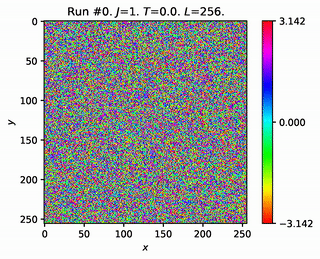
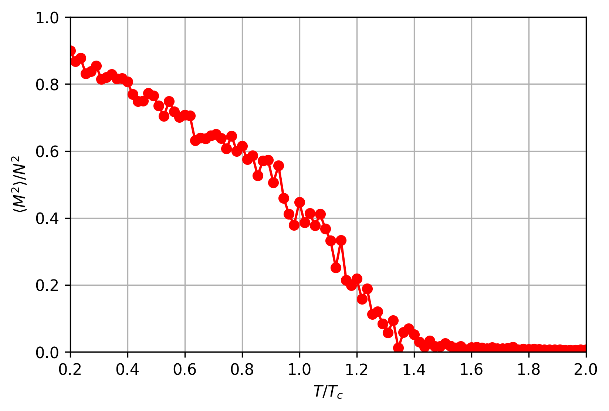
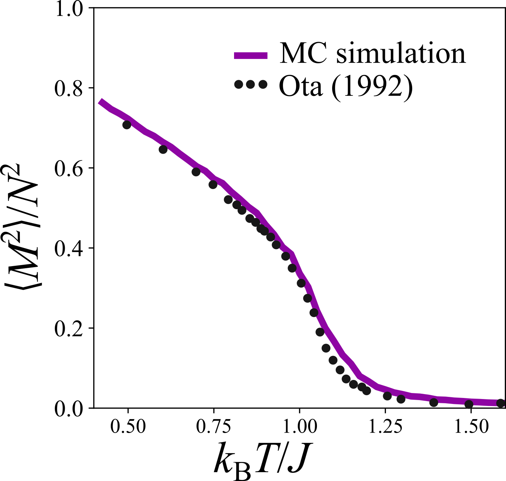
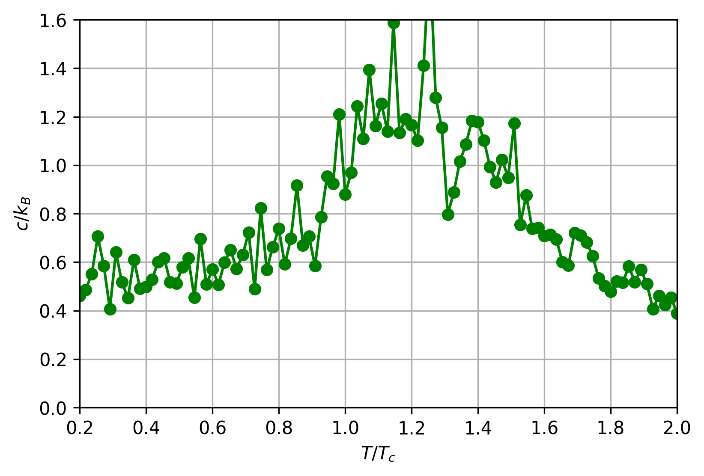
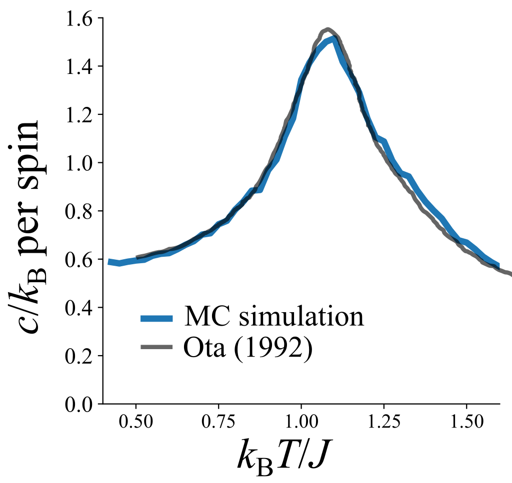
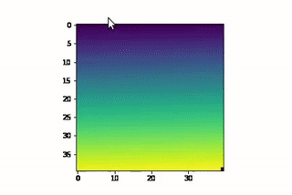

# Project 3 - 2D Square Lattice XY Model

*For the final project of Computational Physics we encourage you to define your own project!*

*The only requirement we ask for is that it should be a simulation of a physics-related project (but we consider physics-related rather broad, and e.g. simulation of biological systems or an engineering problem are also absolutely ok).*
*We do advise you though to start from a project where there is some existing literature. in this way you have a starting point as well as something to compare your simulation to for validation.*

*We encourage you to discuss your project idea with us during the time of class, or remotely via the planning issue #1.*

*In any case, you need to fill in a short plan (a few lines) together with a reference to literature in the planning issue, and have it agreed by us before May 27 (i.e. latest two weeks before the presentation).*

*If you have problems to come up with a good project, we can provide you with proven project ideas. But we first want you to try coming up with your own project! Having designed your own project will also give a small bonus for the grade.*

## Authors

* @[bernwo](https://github.com/bernwo)
* @[juandaanieel](https://github.com/juandaanieel)

## Links to issues

* [Issue 1](https://gitlab.kwant-project.org/computational_physics/projects/Project-3_kwo/-/issues/1)
* [Issue 2](https://gitlab.kwant-project.org/computational_physics/projects/Project-3_kwo/-/issues/2)
* [Issue 3](https://gitlab.kwant-project.org/computational_physics/projects/Project-3_kwo/-/issues/3)

## Journal: Week 1

This week, we have implemented the high-speed Metropolis algorithm using `NumPy` and `Numba`. The evolution of the simulation can be seen in the animated `.gif` below, where we begin with a completely homogeneous lattice state, and slowly increase the temperature past the critical temperature $`T_c≈0.892937J/k_B`$, (see [here](http://www.lps.ens.fr/~krauth/images/7/72/Stage_Mayer_Johannes_2015.pdf))).

*Note: The $`T`$ in the plot title is in units of $`T_c`$. Thus, if it shows $`T=1`$, it means the system is at the critical temperature.*

<!--  -->
where τ is the relaxation time, i.e. the number of metropolis iterations allocated for the system to equilibrate for a given temperature. $`\tau_n`$ is the number of temperature points between the initial temperature $`T_i`$ and the final temperature $`T_f`$.

Here, we see another animated `.gif`, where we begin with a completely random spin lattice, and immediately quench the system to $`T=0`$ with 100000000 iterations. We see that if we quench down to $`T=0`$, pairs of vortices and anti-vortices spontaneously form, where these pairs will eventually collide and annihilate each other.

Now, let us look at the comparison of the phase space and the energy space side by side for a given Metropolis run. Below, see that as we quench down to $`T=0`$ from a completely random lattice state, we stil see disorder begin present in the system. The disorders comes from the formation of vortice/anti-vortice pairs, which are not easily destroyed. We see that as the system evolves, the vortice annd anti-vortice pairs, revealed by their high energy in the energy plot, attract and annihilate each other. Given a long enough evolution time, all pairs will be annihilated and the system becomes ordered again, as it should be at $`T=0`$.

Using the same side-by-side view, let us look at what happens if we lower the temperature slowly instead. Here, we begin with $`T=3T_c`$ and slowly lower the temperature down to $`T=0`$. In this scenario, it seems that the spins in the lattice relax slowly and steadily. Furthermore, no vortex/anti-vortex pairs remain when the system cools down.

## Journal: Week 2

This week, we incorporated the observable calculations into the `Metropolis()` python function itself. The incorporated observables are the followings

* *normalised* magnetisation squared, $`\frac{\left\langle M^2\right\rangle}{N^2}=\frac{1}{N^2}\left\langle\left(\sum_{i=1}^{N} \cos \theta_{i}\right)^{2}+\left(\sum_{i=1}^{N} \sin \theta_{i}\right)^{2}\right\rangle`$, where $`N=L\times L`$.
* specific heat capacity *per spin*, $`c / k_{\mathrm{B}}=\frac{\left\langle E^{2}\right\rangle-{\langle E\rangle}^{2}}{\left(k_{\mathrm{B}} T\right)^{2}}`$, where $`k_B`$ is the Boltzmann constant.

The calculation of the observables can be seen in `Observables.ipynb`.

Below, we find the results for these two observables for the following simulation **set-up**:

* system size, $`L=30`$.
* equilibrating time, $`\tau=500000`$
* extra time, $`\tau_\mathrm{extra}=\tau`$
* initial temperature $`T_\mathrm{init}=0.2T_c`$
* final temperature $`T_\mathrm{final}=2.0T_c`$
* number of points between $`T_\mathrm{init}`$ and $`T_\mathrm{final}`$, $`\tau_n=100`$
* coupling constant, $`J=1`$

**Note**: The observables were calculated by averaging over a temporal ensemble in the time-range after the equilibrating time, i.e. the *extra time*, τ_extra.

### Results: *Normalised* magnetisation squared

Using the set-up as described above, we obtain the following result for the normalised magnetisation squared.

From the [wikipedia page for XY model](https://en.wikipedia.org/wiki/Classical_XY_model), we see the results for the same system size $`L`$.

By comparing the two images, we see that they are somewhat similar with some minor differences. This can be attributed to insufficient equilibrating time or extra time.

### Results: Specific heat capacity *per spin*

Using the set-up as described above, we obtain the following result for the specific heat capacity per spin.

From the [wikipedia page for XY model](https://en.wikipedia.org/wiki/Classical_XY_model), we see the results for the same system size $`L`$.

Again, by comparing the two images, we see that they are somewhat similar with some minor differences. This can be attributed to insufficient equilibrating time or extra time.

### Invaded cluster algorithm

The [invaded cluster algorithm](https://arxiv.org/pdf/cond-mat/9507094.pdf) can be useful for simulating the critical point the xy model.
It is based on the idea of [percolation](https://www.uio.no/studier/emner/matnat/fys/FYS4460/v20/notes/book.pdf).
The procedure of a single alogorithm itarion is as follows:
* Generate a random unit vector $`\hat n`$ in 2D.
* Create a cluster with a single element at every point in the lattice, i.e. $` s_i`$.
* Check if a cluster and one random neighbor are aligned, that is, $`s_i\cdot\hat n s_j\cdot\hat n > 0 `$.
* If so, add them to the cluster with probability $`P(\beta) = 1 -e^{-J\beta}`$.
* Continue this process until a single cluster spans the lattice, i.e. crosses from left to right or top bottom.
* Flip all clusters with probability 1/2 with respect to $`\hat n`$.
We start from an anbitrary temperature $`T`$, and by allowing the system to relax and measuring the new temperature, we update the system. Ultimately, one obtains the critical temperature of the system without any a pripori knowledge.

We have implemented the evolution rule for the cluster formation and percolation. In the following video one can observe a lattice percolation model of size $`L=100`$ and probability $`p=0.8`$. We are finishing the details on the xy model implementation.

